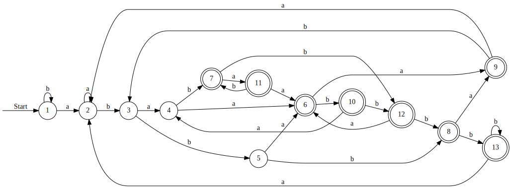
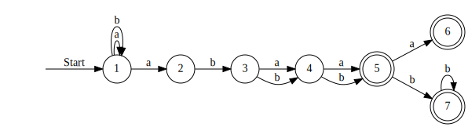
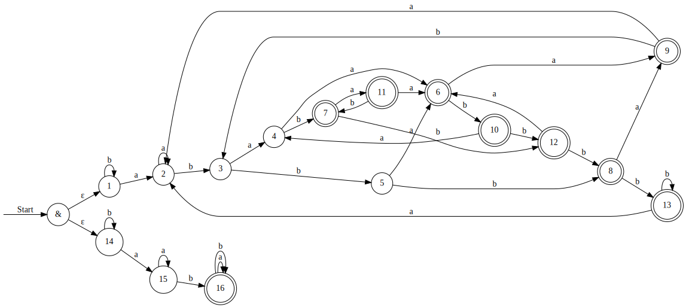

# Исходное регулярное выражение (вариант 27)

L = `(a|b)*ab(a|b)(a|b)(a|b*)`

---

# Минимальный ДКА

---

# Таблица префиксов и суффиксов для обоснования минимальности ДКА

|       | $\varepsilon$  | a | b | ba | bab | aaa |
|-------|---------------|---|---|----|-----|-----|
| b     |         −      | −  | −  | −   |  −   |  −   |
| a     |         −      |  − | −  | −   |  +   |  −   |
| ab    |         −      |  − | −  | +   |  +   |  +   |
| aba   |         −      |  + | +  | +   |  +   |  −   |
| abb   |         −     |  + |  + |  +  |   −  |   −  |
| abaa  |         +      | +  | +  |  −  |  +   |  −   |
| abab  |         +      | +  | +  |  +  |  +   |  +   |
| abbb  |         +      | +  | +  |  −  |  −   |  −   |
| abaaa |         +      | −  | −  |  −  |  +   |  −   |
| abaab |         +      | −  | +  |  +  |  +   |  +   |
| ababa |         +      | +  | +  |  +  |  +   |  −   |
| ababb |         +      | +  | +  |  +  |  −   |  −   |
| abbbb |         +      | −  | +  |  −  |  −   |  −   |

---

# Возможно малый НКА

---

# Таблица префиксов и суффиксов для частичного обоснования минимальности НКА

|   | aaa | baa  | aa  |  a |  $\varepsilon$  | abbb |
|---|---|---|---|---|---|---|
| ab  | +  | +  | +  | −  | − | + |
| a  | −  |  + | −  |  − | − | + |
|  abb | −  | −  | +  | +  | − | + |
|  abbb |  − | −  |  − | +  | + |  + |
| abbbb   |  −  |  −  |  −  |  −  | +  |  + |
|  $\varepsilon$  | − | −  | −  | −  | − |  + |

---

# ПКА
Для построения переключающего конечного автомата буду использовать инвариант - обязательное вхождение одной из подстрок: abaa, abab, abba, abbb.

---

# Таблица префиксов и суффиксов для ПКА

---
# Расширенное регулярное выражение

L' = `^.*ab..(a?|b+)$`

Чтобы построить расширенное регулярное выражение, достаточно было заметить:
1) Альтернатива `(a|b)` представляет собой любой символ алфавита,
поэтому ее можно заменить на wildcard-операцию `.`.
2) Альтернатива `(a|b*)` в конце регулярного выражения можно представить как
(a| $\epsilon$ |bb*), где (a| $\epsilon$ ) можно заменить на опцию `a?`, а `bb*` -
на положительную итерацию `b+`.
3) В начало и конец регулярного выражения добавим маркеры начала и конца строки
(`^` и `$`).
