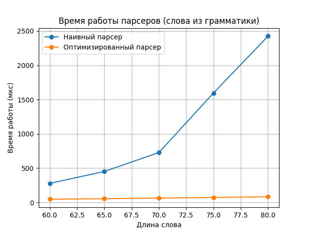
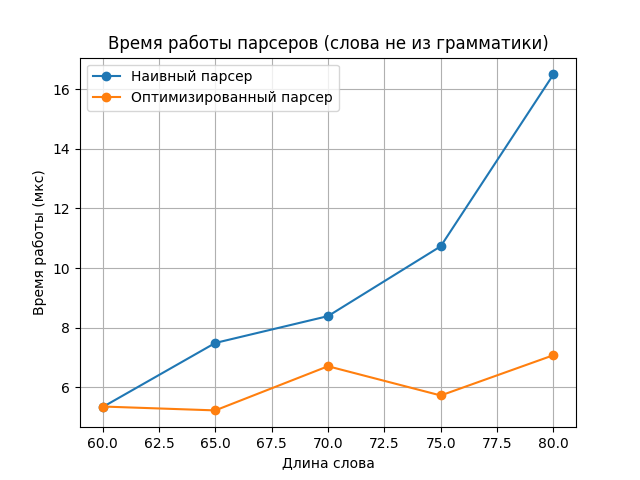

# Исходная атрибутная грамматика (вариант 27)
$S \to SaSb$  
$S \to TT \qquad T_1.z==T_2.z \cdot 3$  
$S \to bab$  
$T \to bbT \qquad T_0.z := 2 \cdot T_1.z + 1$  
$T \to \varepsilon \qquad T.z := 0$

# Преобразование к эквивалентной грамматике  
Рассмотрим правило $T \to bbT \qquad T_0.z := 2 \cdot T_1.z + 1$.  
Очевидно, нетерминал $T$ порождает строки вида $(bb)^k$, причем  
атрибут $z = 2^k - 1$, это можно доказать по индукции:  
* при `k = 0` $T$ порождает $\varepsilon$, проверим формулу: $z = 2^0 - 1 = 0$  
* пусть формула верна при `k = n`, тогда $T_0.z = 2 \cdot T_1.z + 1 = 2 \cdot (2^n - 1) + 1 = 2^{n+1} - 1$

Рассмотрим правило $S \to TT \qquad T_1.z==T_2.z \cdot 3$  
Из предыдущего рассуждения $T_1.z = 2^{k_1} - 1$, $T_2.z = 2^{k_2} - 1$.  
Итак, условие сводится к уравнению:  
$2^{k_1} - 1 = 3 \cdot (2^{k_2} - 1)$  
$2^{k_1} = 3 \cdot 2^{k_2} - 2$  
Пусть $k_2 \ge 2$, тогда $(3 \cdot 2^{k_2} - 2)$ mod 4 = 2  
Тогда $2^{k_1}$ mod 4 = 2 только при $k_1=1$:  
$2 = 3 \cdot 2^{k_2} - 2$  
$4 = 3 \cdot 2^{k_2}$  
$3 \cdot 2^{k_2} > 4$ при $k_2 \ge 2$, поэтому при $k_2 \ge 2$ решений нет.  

Таким образом, возможны решения при $k_2 = 0$ или $k_2 = 1$:  
1) $k_2 = 0$  
   $2^{k_1} = 1$, тогда $k_1 = 0$  
   В таком случае $S \to TT$ порождает $\varepsilon$  
2) $k_2 = 1$  
   $2^{k_1} = 4$, тогда $k_1 = 2$  
   В таком случае $S \to TT$ порождает $b^6$

Таким образом, атрибутная грамматика преобразуюется в эквивалентную ей грамматику:  
$S \to SaSb | bab | b^6 | \varepsilon$  

---
# Анализ языка на КС свойство  
Так как атрибутная грамматика эквивалентна контекстно-свободной грамматике, то язык,  
заданный такой грамматикой, является **контекстно-свободным**.  

---
# Анализ на регулярность  
Пересечем язык, заданный нашей КС-грамматикой, с регулярным языком, заданным регулярным  
выражением a\*b*. Так как регулярные языки замкнуты относительно пересечения,то если  
исходный язык $L$ регулярен, то $L' = L ∩ R$ также регулярен.  
По заданной грамматике единственный способ породить слово, начинающееся с a* - применять  
правило $S \to SaSb$ и левый $S \to \varepsilon$. После этого слово преобразуется к виду:  
$a^nSb^n$ и средний нетерминал $S$ можно переписать лишь по правилам: $S \to b^6$ или $S \to \epsilon$  
для соответствия регулярному выражению.  
Таким образом, языку $L'$ принадлежат только слова вида $a^nb^n$ и $a^nb^{n+6}$.  
Так что можно составить бесконечную таблицу префиксов-суффиксов, доказывающую нерегулярность языка $L'$:
|   | b | bb | bbb  | bbbb | bbbbb  | ... |
|---|---|---|---|---|---|---|
| a  | +  | − | −  | −  | − | − |
| aa  | −  |  + | −  |  − | − | − |
|  aaa | −  | −  | +  | −  | − | − |
|  aaaa |  − | −  |  − | +  | − | − |
| aaaaa   |  −  |  −  |  −  |  −  | +  | − |
|  ...  | − | −  | −  | −  | − |  + |

В этой таблице не будет двух одинаковых строк, потому что в языке не может быть слов, где букв a больше, чем  
букв b, так что она верхнетреугольная.  
Итак, язык $L'$ нерегулярен, значит исходный язык $L$ также **нерегулярен**.  

---
# Оптимизация парсера  
Для начала избавимся от левой рекурсии в грамматике:  
$S \to BR$  
$B \to bab | bbbbbb | \varepsilon$  
$R \to aSbR | \varepsilon$  

## Оптимизация для слов не из языка  
Перед полноценным парсингом слова будем проверять следующий инвариант.  
**Суффиксное свойство**: при проходе от конца слова до начала ни на каком  
шаге количество букв `b` не станет меньше количества букв `a`. Это достигается, потому что:  
* Базовые слова `bab`, `bbbbbb` содержат больше букв `b`, чем букв `a` и не заканчиваются на `a`;  
* Правило $S \to SaSb$ всегда порождает `a` левее, чем `b`.  
Вдобавок к этому если встретили символ не из алфавита, слово также не принадлежит грамматике.
Такая проверка проходит в худшем случае за $O(n)$.

## Общая оптимизация  
Применим мемоизацию:  
* Для каждой пары `(i, j)` будем запоминать:
  1) Выводимо ли подслово `s[i:j)` из нетерминала `S`;  
  2) Выводимо ли подслово `s[i:j)` из нетерминала `R`;  
  3) Статусы обеих проверок: пара `(i, j)` не проверена,
     проверяется или уже проверена.
* В худшем случае мы перебираем все комбинации `(i, j)` за $O(n^2)$;
* Каждая пара `(i, j)` в худшем случае проверяется за $O(n)$;
* Таким образом, худшая сложность для оптимизированного парсера $O(n^3)$.
## Графики сравнения времени работы для оптимизированного и наивного парсеров  

  
